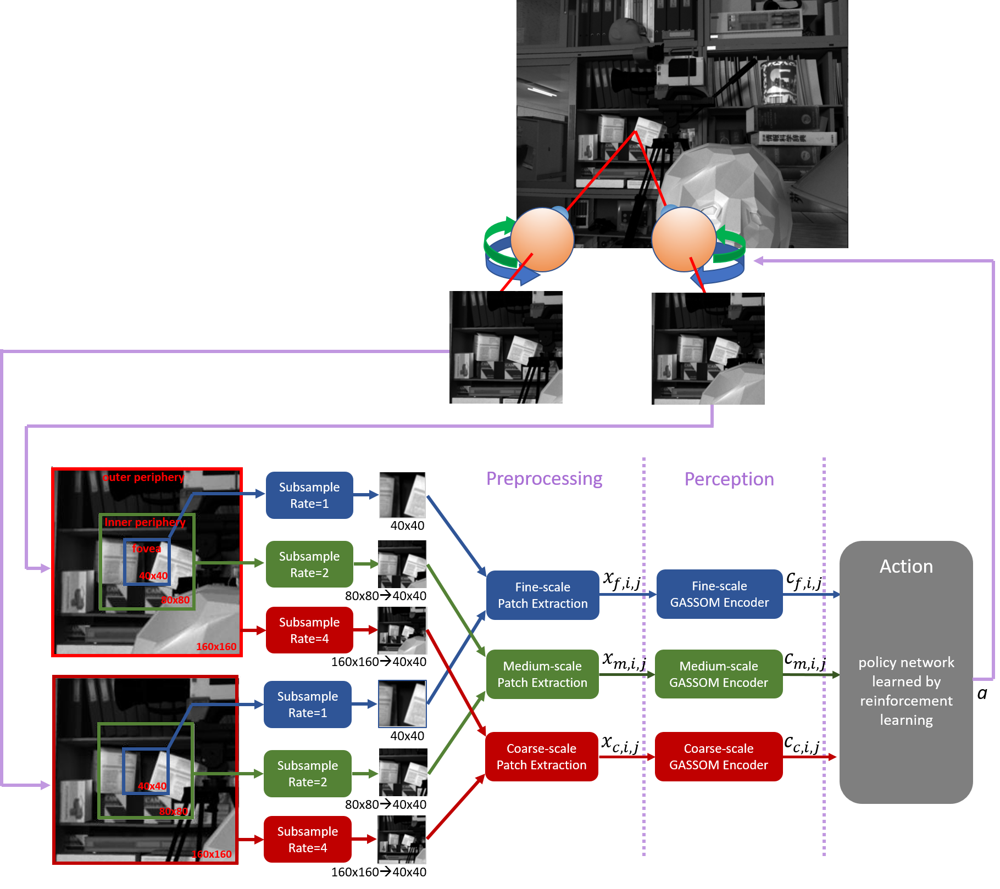

# Joint learning of vergence control 
When visual system develops, the sensory part and motor part develop in the same time. In other words, motor behaviors (like eye movments) are driven by encoded sensory input, while it also shapes the statistics that exposed to our visual system, which will influence how the visual system encodes the visual features. Therefore, how these two factors that have mutal impact develop simutenously is an interesting question. Here we investigate this broad question in a specific senario, the vergence eye movement.

In vergence motion, two eyes move in the opposite directions to change fixation into a different depth. This type of eye movement is mainly driven by disparity information encoding the retinotopic shift of the same stimulus bewtween two eyes. On one hand, how well the vergence recovers the disarity will shape the statistics of disparity in the visual input, while influence the optimal encoding strategy of the disparity in V1 neurons. On the other hand, how the disparity is represented in the visual system also will affect how vergence mechansim.

In this project, we used spase coder to model disparity encoding in V1 and reinforment learning algorithms to model the vergence behavior development. The algoritms were implemented in CUDA for faster processing.
